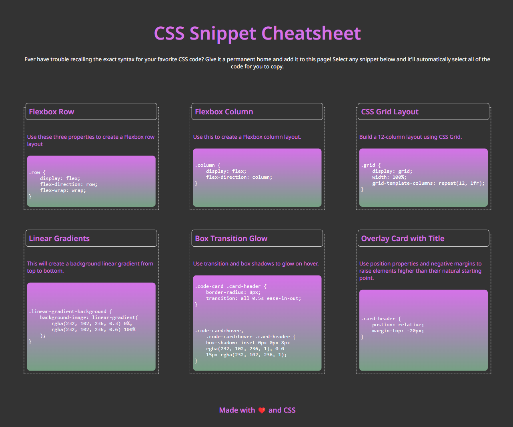

# CSS Cheatsheet

## Description

The purpose of this project is to show the user how to create certain specific styles using CSS. Furthermore, this project was used to show me, as a boot camp student, how to recreate a web app using HTML and CSS when provided with only an image of how the app should appear, but without any HTML or CSS starter code.

## Installation

N/A

## Usage

The interactivity involved in this project is related to hovering the cursor over certain elements on the page. When viewing this page on a desktop, the user can hover their cursor over the code cards or the headers for the code cards to see a box shadow appear.

## Mock-Up

The following image shows the web application's appearance and functionality.

## Credits

The design for this web application was made by viewing an image of a similar project given to our University of Denver Boot Camp class and using my own CSS and HTML knowledge to recreate it.

## License

N/A
